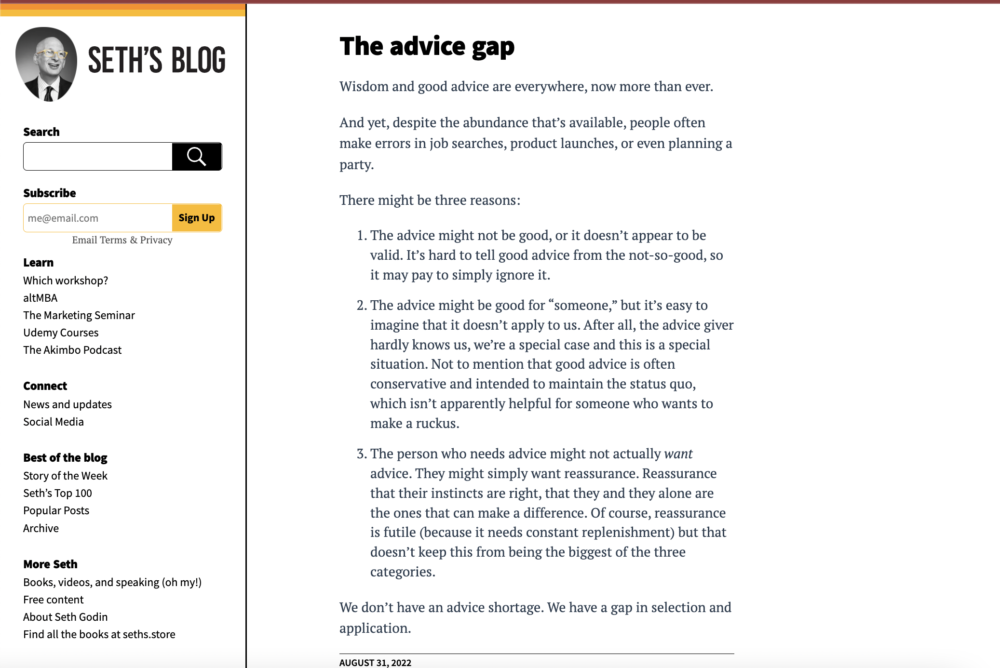
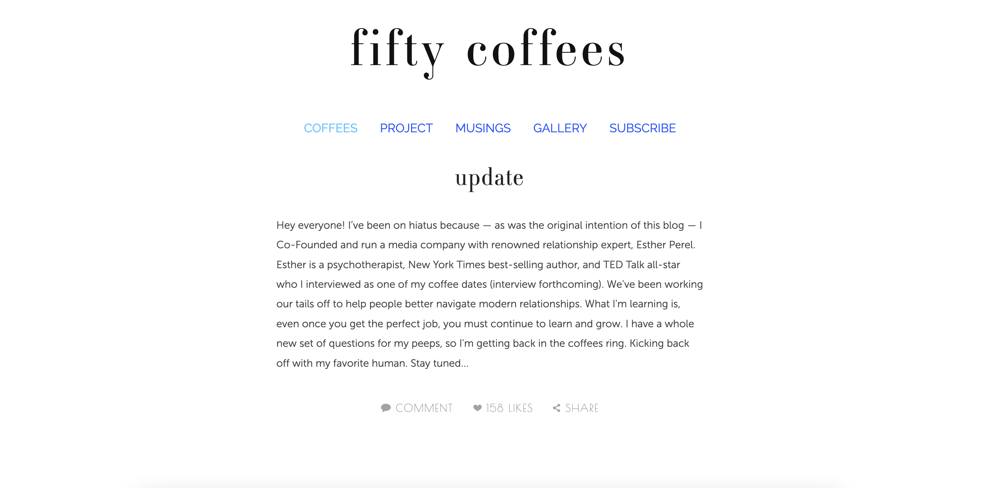
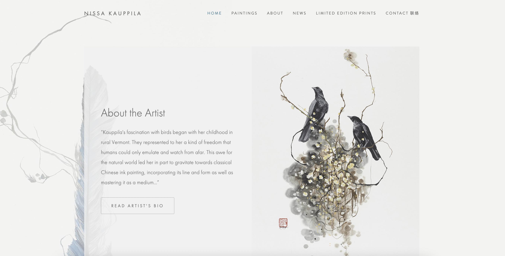
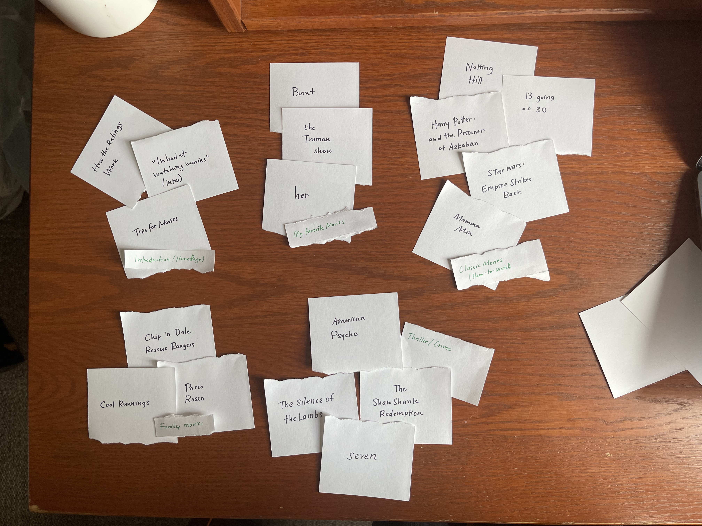
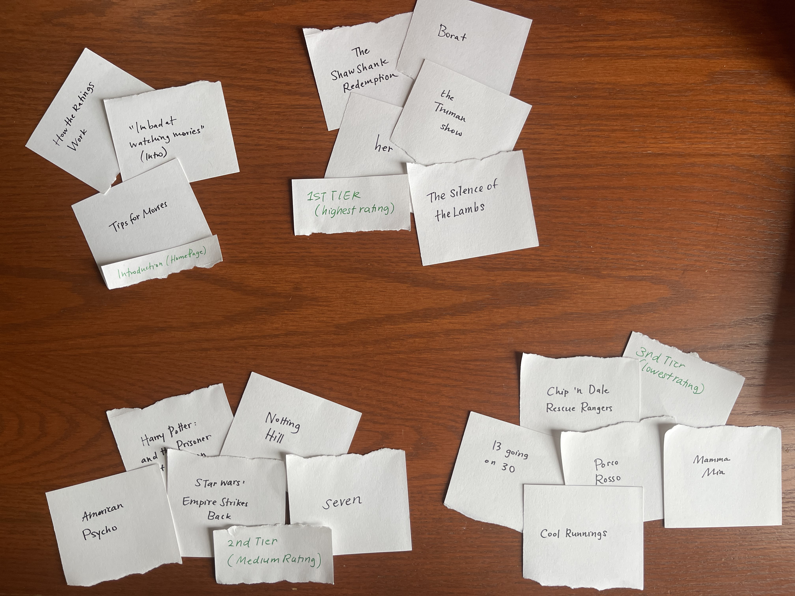
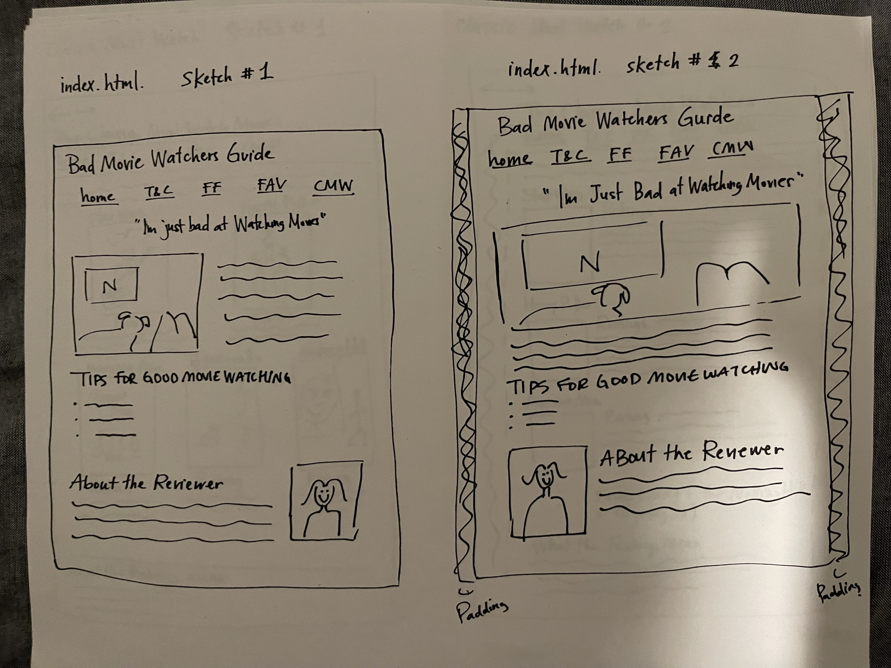
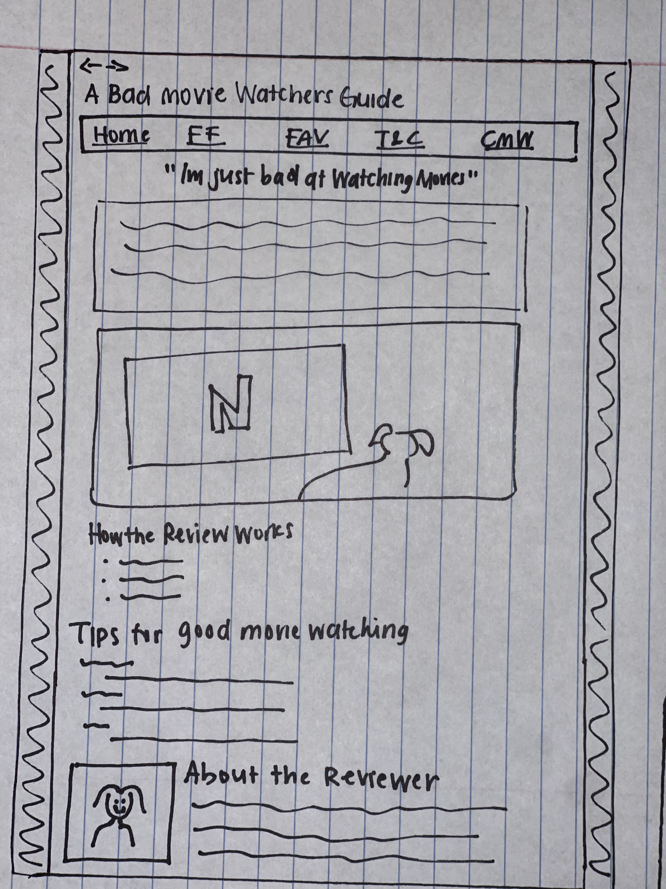
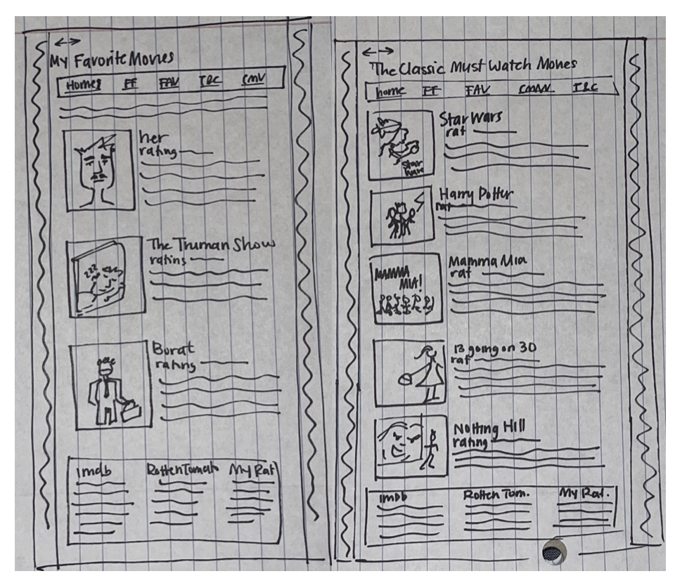
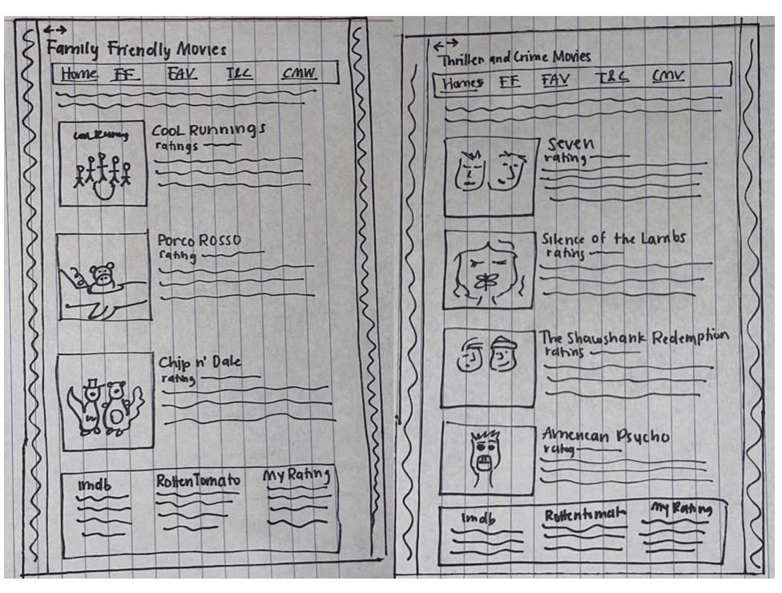

# Project 1: Design Journey

**For each milestone, complete only the sections that are labeled with that milestone.** Refine all sections before the final submission.

You are graded on your design process. If you later need to update your plan, **do not delete the original plan, leave it in place and append your new plan _below_ the original.** Then explain why you are changing your plan. Any time you update your plan, you're documenting your design process!

**Replace ALL _TODOs_ with your work.** (There should be no TODOs in the final submission.)

Be clear and concise in your writing. Bullets points are encouraged.

**Everything, including images, must be visible in _Markdown: Open Preview_.** If it's not visible in the Markdown preview, then we can't grade it. We also can't give you partial credit either. **Please make sure your design journey should is easy to read for the grader;** in Markdown preview the question _and_ answer should have a blank line between them.

## Personal Site (Milestone 1)

### Website Topic (Milestone 1)
> Briefly explain what your website will be about. Share your vision of your personal website.
>
 During the lockdown period, I got very interested in watching movies. I was initally motivated to watch the movies that are considered the classics or often appear in "movies you have to watch before you die" lists. The problem was that there were so many movies and lists on the internet and no guidance of what to start with. My website will be a guide to the movies Ive been watching and my reviews. The site will include movie reviews and recommendations. I want my website to be a collection of reviews and movie insights from a person who loves movies but isnt an expert at them. In doing so, I hope to provide an information hub for people like me that often feel overwhelmed when choosing what movie to watch.

### Device (Milestone 1)
> How you will your audience likely access your website? On a laptop/desktop computer or a mobile device?
> You will design your website for mobile or desktop devices (not both).

My audience should access the website through desktop devices. Specially when streaming movies on the computer, having this website readily available before they start watching a movie would be helpful.

## Personal Website Design Exploration (Milestone 1)

Identify three personal websites (preferably static websites) that exist today on the web. You will be drawing inspiration from these sites for your own site; please select websites that are similar to the website you wish to create.

Include a screenshot of the home page for each site. If you're planning a mobile website, your screenshots should be from a mobile website. If you're planning a desktop website, your screenshots should be from a desktop website.

**We'll refer to these are your "example websites."**

1. <https://seths.blog/>
  

2. <http://www.fiftycoffees.com/coffees>
    

3. <https://nissakauppila.com/home>

    

### Personal Website 1 Review (Milestone 1)
> Review the personal website you identified above. (1-2 paragraphs)
>
> - Who do you think this site is designed for? Who is its intended audience?
> - What **goals** do you think the audience likely has when visiting this site.
> - What **content** is included?
> - Do you believe the content likely **addresses** the goals of the site's audience?
> - What do you like about the design?
> - Is the site designed for desktop, mobile, or desktop and mobile devices?

Seths blog is a personal site by Seth Godin. This site has a lot of different content and elements to look at. Primarily, it contains blog posts and opinion pieces on literature, business and societal topics. Godin is a published author and has worked in a lot of projects so I think his main audience are people that follow as a role model or expert in a field. The site is designed for people interested in the topics that Godin is an expert in. Specially in reading opinion pieces about current events or philosophical questions. The audience is definitely composed of adults that  work in a business or are interested in how business practices and sociology intersect. It is a professional site, with a lot of advice and thorough out pieces about our society and certain business, which prompts me to believe the audience are adults in those fields.

The main content are the blog posts, some short philosophical posts while other critiques and advice on current events (of businesses and technology) and personal growth. The blog also includes content of Seths books and events as well as his socials and where to find him and his businesses. I think the content definitely addresses the goals of the sites audience. People who are interested in reading these critiques from an expert in the field can easily find and read them. Additionally, the way the content is divided is helpful to find what you are looking for. With the main blog posts in the home page and other material in their respective tabs. I also like that the longer blog posts aren’t in the home page, but rather you get a snippet of the post and can then click on the title to continue reading. This helps as the home page isnt overloaded with text. This site is designed for both desktop and mobile.

### Personal Website 2 Review (Milestone 1)
> Review the personal website you identified above. (1-2 paragraphs)
>
> - Who do you think this site is designed for? Who is its intended audience?
> - What **goals** do you think the audience likely has when visiting this site.
> - What **content** is included?
> - Do you believe the content likely **addresses** the goals of the site's audience?
> - What do you like about the design?
> - Is the site designed for desktop, mobile, or desktop and mobile devices?

This desktop website contains blogs of a woman who is challenging herself to have 50 coffee chats with different people and document the takeaways of the interactions. I think the site is designed for audiences that seek advice or want to do the same challenge the blogger is doing. The audience is probably people in their mid 20s to 30s. The content focus is self improvement and career navigation. I think the goal that the audience has when looking at the site is both to be entretained (due to the blog style content) and find useful advice for their lives. The blog portion of the website can definitely be something that the audience enjoys reading in their free time, but it also provides a learning and reflective space in the advice and information portion of the blog.The main content of the website surrounds the conversations she has with these people. Some are questions and answers while others simply recount the experience. There is also a page explaining the project and a gallery of the photos she has taken.

I think the content does address the goals of the audience. The takeaways and advice of the conversations are emphasized throughout the website and its definitely a blog that people early in their careers can read to find guidance and advice for their futures. I wish there was a section dedicated to summarize the advice and takeaways because at times they are hidden in the long paragraphs. I like the simplicity of the site and the use of different headings and colors to separate the content. I really like how the interviews are sectioned off. There is a photo of the drink, a section with information about who the person was, where they met...etc and then the conversation in a smaller font and paragraph structure. I think this is the structure I will use for my reviews because I think it helps the content be organized in a logical but pretty way. This site is designed for both desktop and mobile, but I found that it was easier to navigate on the desktop version.

### Personal Website 3 Review (Milestone 1)
> Review the personal website you identified above. (1-2 paragraphs)
>
> - Who do you think this site is designed for? Who is its intended audience?
> - What **goals** do you think the audience likely has when visiting this site.
> - What **content** is included?
> - Do you believe the content likely **addresses** the goals of the site's audience?
> - What do you like about the design?
> - Is the site designed for desktop, mobile, or desktop and mobile devices?

This site displays art works and information of the artist Nissa Kauppila.  The audience of the site is definitely people in the art industry or people interested in buying or exploring the art. The intended audience seems to be for art collectors or galleries since large part of the website has content relating to contact information and past gallery projects. The site works as a portfolio for the artist. This is evident because of the type of content of the site. It has an expository format where audiences can see the art that Kauppila has done and learn about the different galleries and shows she has been part of. The audience’s goal is to learn more about the artist, explore her paintings and work and possibly buying or commissioning a piece of art.

The content in the site is mainly focuses on the art and galleries. There is a whole section that talks about who the artist is and their background. There is a page dedicated to the work (serves as a portfolio). Other pages include past gallery showings and awards and a contact page. I think this content does meet with the goal of the audience. You are able to see the art really clear and possibly buy a piece while you are on the site. The contact page with information about commissions and work is also included for visitors that may be interested in that. What I like most about the design is the page separation. I think the designers did a really good job separating what content should go where. There isnt an overlap of content or misplaced information.

## Audience & Goals (Milestone 1)

Using what you learned from studying the example websites, identify your website's audience and their goals.

### Audience (Milestone 1)
> Briefly explain who the intended audience is for your website. Be specific and justify why this audience is appropriate for your site's topic.

Future movie enthusiasts who need a guide to how to start watching movies and which ones to start with. The audience of my website are individuals interested in expanding their movie culture knowledge and finding a good movie to watch. My audience inclused people who are indecisive or need movie recommendations. I specially want to cater to an audience that does not have a lot of expertise in movies. The whole purpose of my website is to provide people who arent good at watching movies a page to learn about movies. There isnt an age or demographic particularly specific, I think a lot of people could be interested in a site like this. The movies I watch are mostly in English, so the audience is limited to people who watch movies in English.

### Audience Goals (Milestone 1)
> Why would your audience visit your site?
> Identify at least 3 goals that your users have for visiting your website.

1. Individuals who want to become movie enthusiasts and want to find a guide to begin
2. Movie watchers hoping to compare and read reviews about movies they watched or might watch
3. Individuals searching for movie recommendations
4. Generate a list of movies to watch

## Content Planning (Milestone 1)

Plan your site's content.

### Your Site's Planned Content (Milestone 1)
> List **all** the content you plan to include your personal website.
> You should list all types of content you planned to include (i.e. text, photos, images, etc.)

- Introduction to my movie hobby
- Tips for watching movies
- Tips for watching movies
- About the Reviewer
- Reviews
  - The Shawshank Redemption + Picture of the cover
  - American Psycho + Picture of the cover
  - Seven + Picture of the cover
  - Silence of the Lambs + picture of the cover
  - Chip and Dale: Rescue Rangers + picture of the cover
  - Porco Rosso +Picture of the cover
  - Cool Runnings + Picture of the Cover
  - Harry Potter and the prisoner of Azkaban + picture of the cover
  - Star Wars: the empire strikes back + picture of the cover
  - Mamma Mia+ picture of the cover
  - 13 going on 30 + picture of the cover
  - Notting Hill+picture of the cover
  - The Truman Show + picture of the cover
  - Her + picture of the cover
  - Borat + picture of the cover
- My future watch list (movies I have yet to watch but hope to watch soon)

### Content Justification (Milestone 1)
> Explain (about a paragraph) why this content is the right content for your site's audience and how the content addresses their goals.

The goal of my site's audience is to learn about movies, find recommendations and be motivated in order to become better movie watchers. Doing so in a way that is much more friendlier and informal compared to highly technical review pages. The idea is that people feel personally connected to the author and through that explore more movies.This made at home guide to movie watching aims to help individuals who are interested in the movie industry. In order to accomplish these goals, I want the content of my site to be the recommendations of some of the most important genres and titles in the movie world. The content spans various types of movies, from crime, to fantasy, animation and romance. The audience will be able to browse through the reviews and find the perfect movie for their movie night. The reviews will explain what is good about the movie movie and why the audience should watch it from the perspective of someone that doesnt have a highly technical expertise in movie culture, tropes, directors or industry. I think this is the best content for individuals to accomplish this goal because it provides various recommendations along with the rationale of why I think they should watch it. Doing so, it eliminates the need to search up every movie individual and finding reviews and synopsis. Additionally, I want to add multiple ratings (other than my own) to give the audience the information necessary to decide if they want to watch the movie or not and add some objectivity to a highly subjective opinion review. I think the content, at its early stages might be a little limited in terms of how many movies are reviewed. I hope to continue writing more reviews as my own personal challenge continues.

### Home Page Content (Milestone 1)
> What is the content that your users would expect when visiting your site for the first time.
>
> Briefly identify what content you will include on the homepage and why this content should be the first thing your target audience sees when they visit your site.

I want my homepage tell my audience what the website is for. My objective is that when they see the homepage they can read about the challenge I set to myself to watch more movies and document my thoughts on the movie. I hope that as they read it, they relate to my experience and that pulls them in into wanting to join me in my personal challenge. I also want them to know that these are not reveiws of someone who is an expert in movies but rather the opposite. To do so, I want to add some information about who I am to establish the trust and relationship between the audience and the author. I also want the structure to indicate to users how the website is formated so they may navigate freely.

The content that my hope page will include

- A picture of the author (me) watching movies (setting the scene of who I am as a movie watcher)
  - Makes the audience identify me as a normal person watching movies on the couch (emphasizing the whole methodology (or lack thereof))
- A paragraph explaining my project and what I hope to accomplish
  - Introduction to my page so the audience understand my goals
- An "about the reviewer" section
  - Identify myself to the audience so they know who I am
  - Makes the reviews a little more personal and less serious
- Tips to watch movies
- A navigation component for users to look at the reviews

## Information Architecture (Milestone 2)

For milestone 2, you will design the information architecture for all the pages your website.

You may change your homepage content based on your card sorting. If you do change the homepage content, don't update it above, just include the new plan in the section below (Content Organization).

### Content Organization (Milestone 2)
> Document your **iterations** of card sorting here. You must have at least 2 iterations of card sorting.
> Include photographic evidence of each iteration of card sorting **and** description of your thought process for each iteration.
> Please physically sort cards; please don't try and do this digitally.

The first process of the iteration I made was by movie types/genre. I thought this was a good idea for the goal of my website. By sorting by type, the audience would be able to go to the page that has the movie type that they are interested in. For example, if they want Family Friendly movie recommendations, they would navigate to this "pile" of content. The only type that I grouped a little different was the My Favorite pile. I think that because this website is a personal website and I am blogging about my opinions and reviews of the movies, it makes sense to have a section dedicated to my top movies. I looked up the genres of each movie and grouped them based on the genre. The note cards that I had left were grouped as the home page content.

The second iteration that I made was based on ratings. Using the content I have already written, I looked at the ratings that I had given each movie. With these ratings I made 3 piles of the three tiers of score. The first tier being the highest rated, the second being the second highest rated and so on. I thought this would be a good way to sort because it allows the audience to see the highest ranked movies faster. However, this might not be the best structure because I think it sends the wrong message with the 3rd tier. All of the movies on this blog are recommended for different reasons. Ranking them with reviews sends the message that the third tier are the worst movies and they shouldnt be watched. That is not what the content is about.

### Final Content Organization (Milestone 2)
> Which iteration of card sorting will you use for your website?

I will be using the first iteration of the cardsorting.

> Explain how the final organization of content is appropriate for your site's audiences.

One of the main goals that my audience will have is finding good movie recommendations to start their journey of becoming good movie watchers. This personal website's purpose is that if people want to watch more movies and dont know where to start they can use this as a guide. But the audience may want a recommendation for a type of movie. When I want to watch movies I first narrow it down to what type, a romantic comedy, a superhero movie, fantasy or crime. Separating the reviews by genre makes sense because if the audience wants recommendations for a thriller movie, they can navigate to the thriller recommendations. It is much easier for a user to find the information that they are looking for if it is divided in this way. While the second iteration is more personal because it depends on my ratings, it doesnt satify the goals that well. Specifically because it sends the message that the movies that are the lowest rated are bad, which is not what Im trying to say. In fact, all the movies are recommendations, so dividing the content in this way doesnt make sense because these recommendations will look like they are not being recommended.

### Navigation (Milestone 2)
> Please list the pages you will include in your website's navigation.

- Home
- Thriller and Crime Movies
- Family Friendly Movies
- The Classic Must Watch Movies
- My Favorite Movies

> Explain why the names of these pages make sense for your site's audience.

After the cardsorting processes I labeled each of the piles that I had with a representative name. The names describe what type of movie they are (specifically their genre/type). I felt that using these representative names would be the most logical for the user experience. With the audience I have in mind, I can imagine them looking in the website for a movie recommendation and wanting to chose one that fits the mood that they are in. By dividing my content with these different types the audience of my website will most naturally navigate the site to meet their goals. The page names should be short and give the audience enough information about what they will be able to find in that page. However, I do want to note that the Classic and My Favorite movies pages arent titled by genre. I was careful to make sure that no movie in those two piles belonged to the other genres. I still decided to name these pages their respective ways because it is a personal website about my reviews so I thought it would be useful to have a page for movies that are considered classics and a page for what have been my favorite movies.

## Visual Themes (Milestone 3)

**Make the case for your decisions using concepts from class, as well as other design principles, theories, examples, and cases from outside of class.**

Remember to focus on the things we can't see just by looking at the site: changes, alternatives considered, processes, and justifications.

Each section is probably around 1 reasonably sized paragraph (2-4 sentences).

### Theme Ideas (Milestone 3)
> Discuss several (more than two) ideas about styling your site's theme. Explain why the theme ideas are appropriate for your target audiences.

An idea that I have for a theme is to make it seem like a movie theater. One of the goals of the audience is to enjoy watching movies, specially at home and those that are not in the theaters. Mimicking the theme of a traditional movie theater (Dark background with red accents for the curtains and maybe yellow to represents the light or popcorn) would be appropriate because it would make the audience feel that watching a movie is not only watching content but rather the experience and spectacle of the story.

One of the themes I was thinking of implementing is at home streaming theme. Due to the pandemic and isolation, most of the movie nights that we have are at the comfort of our home. More now then ever, there is a streaming platform for every kind of media you might want. Because of this, I was thinking of designing each page to be inspired by a streaming platform. I think this idea would be appropriat for my audience because it is very relevant to the type of content I have. Having a page have Netflix's colors and another one with Hulu's would be a playful theme very connected to the nature of the webiste. However, the content isnt divided into streaming service so it may be confusing for the audience.

Another idea stems from the at-home relaxing part of my website. My site reviews movies that would be watched at home, and the audience, as myself, would probably watch movies as a pastime and to relax. Using this, the mood of my website can be very soothing and relaxing. Very inviting for people that are nervous to start watching movies.

### Final Theme (Milestone 3)
> Which theme did you select as your final theme? Why?

I am going to be implementing the movie theater theme. I chose it because I think it aligns with my audiences goals more. While movies are definitely watched to relax, the goal of my website is to make people love watching movies and become ethusiasts. Having a more playful theme would lead to more of that excitement. I think about my own feelings when walking into a movie theater, and I think those are the feelings the audience hopes to achieve. The thrill of the giant movie screen and dark room makes the movie even more enjoyable so transmitting that through my website theme will support the audiences goal to enjoy movies.

### Theme Rationale (Milestone 3)
> Discuss your final theme design: how do they fit your overall design goals and audiences?

My final theme will be a playful adaptation of a traditional movie theater. It will fit the audiences goals because it will present the content in a fun and exciting way that will make them look forward to watching the movies. Additionally, I want the theme of the movie theater to generate the same emotions as the audience would feel a movie theater. The excitement and theatrical anticipation of watching a narrative unforld. The design elements that I will use will colors that are traditionally in a movie theater: Red from the curtains, black/dark for when the movie is playing, yellow for popcorn. I want it to be subtle but evoke emotions of excitement and anticipation from the audience.

> Emotion is a big part of design. What emotions were you thinking about or trying to convey in your designs?

- Excitement
- Anticipation
- Fun
- Entering a "magical" or fictional world
- Nostalgia (of old movie theaters)
- Thrill

## Layout & Composition (Final Submission)

### Home Page Layout (Final Submission)
> Include several sketches of possible layout ideas for the home page.
> Provide an explanation for each sketch explaining the idea.
> Show your design process.
> **Use the example websites above as inspiration for your site's design.**

Index Page
Sketch 1: For my first sketch I went through the html page and just started formating the elements like I thought they would fit best. In this case, I wanted to put the phrase "Im just bad at watching movies" centered and big because I think that sets the scene to the motivation of the website. Then I decided to maybe put the decorative image next to the paragraph of introductory text so that there is a visual element to the paragraph. The tips for watching movies would come next and these would just been in bullet points. Lastly, I added the "about the reviewer" section with the image of me next to the description text. This sketch was based on the putting the information ordered by importance and using different layouts to make the progression of the page logical.

Sketch 2: The big difference between the first sketch and the second sketch is the placement of the pictures. I still believe that content should be ordered by the importance because I want the audiences first exposure to the site to be the header and description of the challenge. I think for this sketch, I used the pictures as a way to break up the amount of text in the website. As a user, I think that images used in the correct way can be very appealing. I decided to put the image covering the whole width of the page. This would break the amount of text in the page (so its not as overwhelming) and could also look nice as users log into the page. It also serves as a decorative division between the introduction of the page and the other information that isnt as central to the content but still interesting to read if the audiences desires.

Note: In the second sketch, I labeled the margins as the padding. This is labeled incorrectly. When doing my final sketch and coding the design elements I was able to further understand the difference between paddings and margins.

### Final Site Design (Final Submission)
> Include a sketch of the final layout for each page in your site.
> Provide an explanation below each sketch.

For the final sketch of the home page (index) I combined aspects of my two sketches. The main decision I had to make was where to put the decorative image. Unlike the first two sketches, I decided to put the image below the introductory text because of the points made in one of the lectures of making sure that the decorative content doesn’t overpower the actual content. As I said in one of the rationales for the first sketches, I want the introductory message to be visible and clear because it is necessary to understand the content and purpose of the website.  If I had the image first then the audience would have to scroll down to find the information instead of having it readily available. I also decided to put the navigation bar in a box. I used it for extra sketches I made of the other pages and I think it is the best way to exemplify the navigation so that it is easy for the audience to use. Lastly, I added the margins on the side for both the layout structure but also because I thought it would go well with the theme.

The other 4 pages are in sketches together because they all hold the same layout. I chose to have all the pages be in the same layout to add consistency throughout my website. Every page has reviews and images based on the movies so I wanted each page to have the same layout so that users could be familiarize with it. By using familiarity, the audience can navigate through the different genre pages without any difficulty or suprises. By designing with layouts the audience already knows, it becomes easier for the audience to find the content they are looking for and navigate the site. To come up with this final layout I picked things from various initial skecthes I made of these pages. Much like the index page, I wanted to have similar margins for the main page. The title and the navigation bar will be the same as the one in the home page (again for consistency and aesthetic). While I initially wanted to design this page as a movie screen layout (I will insert a reference picture below), I ultimately decided against it because I think the text and reviews would get lost easily as the main focus would be on the pictures. However, I do plan to expand on the movie theater theme throught the more stylistic elements like color and borders. While the movie posters are useful content to communicate to the viewer what movie is being reviewed, the main content is the reviews. As such, the reviews should be emphasized. I decided to go with a layout that would still exhibit the movie posters, but would also emphasize the reviews.  This layout has the images to the right and all text content pertaining to the image right besides the movie poster. I think having each movie review follow this layout will ultimately make the content very readable and easily understood. This will also allow for visible separation between the reviews as the white space will work as a “break line” between each review. Finally, I chose to present the ratings key as sketched in the Thriller and Crime sketch. Because most of the content in the pages is laid out horizontally, having this content in columns will make the distinction that it is no longer the review but another type of content.

### Static Website Design Check (Final Submission)
> We're building a static website without interactivity.
> **No part of your website may dynamically change.**
> Examples of dynamic behavior are dropdown menus, hamburger menus, popups, modals/lightboxes, image carousels, etc.
>dfd
> Audit your design and check that you aren't relying on any dynamic features.

My webiste is complete static as there is no interactivity. The only way that users can interact with the content by navigating to another page which is not a dynamic feature.

## Rationale (Final Submission)

**This rationale should be polished writing:** one you might submit as a report to a client or boss to help explain the project and convince them you did a good job. You'll be surprised how much writing and communicating you need to do about projects and choices on internships and jobs; practice that here.

It should be a comprehensive, complete story of the project. You might find that each section runs a few paragraphs (1-2). Sketches can often help tell the story of your design. Screenshots are also useful for describing issues discovered during the design process and how you addressed them.

**All images must be visible in "Markdown: Open Preview" for credit!**

Your rationale should be a polished version of the earlier explanations.

### Audience (Final Submission)
> A complete and polished description of the intended audience(s) for your website.

The intended audience for my website are future movie enthusiasts in seach of a guide to how to start watching movies and which ones to start with. Throughout the process of brainstorming possible website ideas, I was motivated to create something I wish I had a few months ago. Specifically, when my interest in movies started to grow, I was often overwhelmed with the number of movies being thrown at me that I would decide not to watch any. There are a lot of movie review websites and ratings on the internet, but I wanted to create a website for people who didn't know where to start. I also wanted to have a space that I could share my own experience ad my own thoughts. With this idea, I set out to make a website with a collection of reviews of the movies I've been watching since challenging myself to watch the "important" movies. This website demonstrates my journey in learning about movies and building my movie repertoire. The intended audience is precisely people like me who wish to start a movie hobby. The intended audience for this website is individuals  who wish to expand their movie knowledge and experience but do not know where to start or need recommendations.

The reason I chose this audience is that I understand how some movie reviews are overly technical and often make references to directors and actors that might not be known by the reader. It is really overwhelming at times trying to build a hobby that has a lot of complex elements. This website is intended for those that would benefit from a much simpler less technical review of someone who is the average watcher, me. By choosing this group as my intended audience, I was able to come up with the audience goals that would aid in the design of my website.

### Design Goals (Final Submission)
> An explanation of the design goals for that audience, based on your earlier rationales.

The main motivation for my design was to be able to accomplish the goals I had set out for the audience. Firstly, individuals who are not knowledgeable about movies should be able to learn about different movies and their importance in the movie world. The audience will also be able to find movie recommendations so they may continue to grow their movie knowledge. Finally, individuals may also compare their thoughts about the movie with mine, which is a large part of becoming a movie enthusiast. Using my knowledge and hobby of watching movies, this website will provide the audience with that initial step to begin their movie enthusiast experience, but also guide them as they continue.

To accomplish this, I had to make sure I had sufficient content for the audience. This was solely related to the content, but after writing the reviews I had a clearer idea of how I would design the website to make the content stand out. Specifically, my goal was for the design to emphasize the reviews. This is because of two reasons. The first one is the personal experience the audience has, and what sets this website apart from IMDb or Rotten Tomatoes reviews, is the personal narrative I am telling. When people go to the website, I hope they will read some reviews and resonate with how I feel about them. The reviews are also informal and show a lot of my personality to create trust between the author and the audience. These reviews are meant to attract the audience and encourage them to watch these movies. Additionally, for the audience to accomplish their goal of learning more about the movie scene, the reviews must be the focal points of the website. This was an important distinction because upon seeing which content was important for accomplishing the goal, I could start designing to emphasize those components. Additionally, the design of the website had to be simple for people to navigate and find the reviews. Through this, my goal was that people could go into the website and find the reviews easily for the movies they were hoping to watch.

### Content Organization & Navigation (Final Submission)
> An explanation of how the final content organization and navigation met your goals and why it's appropriate for your audience.

The goal of my website design was to emphasize the movie reviews and structure the content so that individuals could find the movie they were looking for easily. To do this, I had to organize the content in a way that made sense for the audience and draw on common website familiarity to enhance the user experience. To organize my content I chose to do it by movie genre/type. I drew on my experience as a movie watcher to make this decision. Often, when I am going to watch a movie, I already have a preset idea of what type of movie I am interested in watching for that day (maybe an action movie or a romantic comedy). Using my own experience as motivation, I resolved that this organization would be the most logical for the website. I decided to create 5 pages, four of which would be different movie themes so that the audience could navigate to the type of movie they were interested in exploring. In addition to that, a home page explaining my own experience with movies and some tips.

I did have to make some adjustments to this organization. While most movie reviews are divided by their genre. I had other movie reviews I wanted to add that didn't fit in the categories that most of the movies were in. Instead, they fell into two categories. The first is culturally important movies. These are the movies that are famous mainstream pictures and stem from different genres. I thought these were important to add because they are often the first movies that people hoping to get into movies should watch. As a result, I created the "Classic Must Watch" page. Lastly, the remaining movies are movies that maybe aren't highly talked about or recommended but I believe are some of the best. Of course, this is highly opinionated, but I believe that the personalized experience sets the reviews apart.

When I had the page content separated, I had to design how the content would be organized within each page. I decided to make each page have the same layout to provide consistency throughout. By doing so, the audience would know what to expect on each page and where to look if they were searching for certain content. I organized the content by organizing each movie into its section which includes the poster, the ratings, and the review.

### Visual Design (Final Submission)
> An explanation of how the final design met your goals and why it's appropriate for your audience.

I was inspired to make the theme of my website look like a traditional cinema. I hoped that the audience of my website would feel the anticipation and excitement one gets when one walks into a movie theater. The bright screen and the red curtain illuminated the dark room. By evoking that feeling from the audience, I hoped that excitement would transfer to how they think about movies while not bombarding the audience with a lot of visual stimulation. I think this happens because other websites are often really overwhelming and may lead people to not want to watch a movie because of the stress of the amount of information provided about a movie. Rather, by making the theme of the website a theatrical representation of the movie theater in a simple abstract way, the audience can be excited to watch more movies and still be able to get the content they need.

As mentioned in the content organization section, I decided to group the content of each movie and follow the same internal organization for each review. Using familiarity and a clear pattern in my website allows the audience to navigate and consume content easily. Using the CSS box model, I structured each movie section to be a rectangle with all the information. Then each page was composed of various rectangles with clear divisions in between. By doing this, the audience finds the information of each movie easily and also has a distinction between each movie so that the content doesn't get mixed up. I think that this way the audience can read about the movies in a better way. I also made sure to design with my theme in mind. I added borders to each movie to make it look like a lightbulb border just like some old-school movie theaters have and made sure the colors continued to follow the theme. I was hesistant at first to add a black background. Not a lot of websites use these dark backgrounds but I thought it was a choice that would most fit my theme. I was also unsure about it because of the high contrast issues. I didnt want the text to be hard to read or straining on the eyes. To design with this in mind, I decided to have a black background with red and yellow accents to fit the theme. For the most important text, I chose to use a lighter grey background and black font so that I would be very easy to read. This would ensure that the theme was still present but that the content readibility was there as well. I also made sure that the red would be bright but not straining to the as, as this is something I did in my first design milestone but as I viewed my site more and more I did find the colors a little too bright and straining. The use of colors was really important because I wanted to make sure the design added to the website, not limit the readibility of the content. I think it turned out well and the audience will feel that excitement of watching a new movie and being in the cinema.

### Self-Reflection (Final Submission)
> Take some time here to reflect on how much you've learned since you started this class. It's often easy to ignore our own progress. Take a moment and think about your accomplishments in this class. Hopefully you'll recognize that you've accomplished a lot and that you should be very proud of those accomplishments!

This was the first time I worked with HTML and CSS in a while and the experience was completely different. My first exposures to HTML and CSS were mostly concerned with making things look nice and designing for the visual components instead of the content. It was definitely challening at times to focus soley on how the content should be structured and how that structue can make an audience feel rather than jump into the visual design elements. While it was hard at times, I did find that not starting with the visual elements actually made the process much easier. By being able to structure and explore different possibilities before actually getting to the implementation, I was able to rationalize what had to be done to achieve my goal. This was definitely true with the first additions of CSS. I feel that if I had jumped into designing without throughly thinking of my theme and my audience, the website wouldnt evoke the emotions that it does now. I think this process has definitely made me rethink of how I tackle more creative projects and will push me to think about each design decision more critically. Overall, Im really happy with the look of my website and I hope to continue adding to it as I watch more movies.

## Grading (Final Submission)

### Mobile or Desktop? (Final Submission)
> Should the graders, grade your site as a desktop site or a mobile site?

The graders should grade the site as a desktop site.

### Grading: Open the Design Journey in Markdown: Open Preview (Final Submission)
> Preview your design journey in VS Code. Please verify that this document is easy to read/grade.
>
> - Remove all _TODOs_
> - All images must be visible.
> - All images must be oriented the correct way.
> - There should be a blank line between the question prompt and your answer.
>
> Is your design journey easy to read?

Yes

### Collaborators
> List any persons you collaborated with on this project.

None

### Resources
> Please cite any external resources you used in the creation of your project.

I used the Mozilla Documentation for HTML and CSS elements and format.
<https://developer.mozilla.org/en-US/docs/Web/CSS/Reference>
<https://developer.mozilla.org/en-US/docs/Web/HTML/Element>

I also used IMDb and Rotten Tomatoes to find the different ratings for the movies
<https://www.imdb.com/>
<https://www.rottentomatoes.com/>
